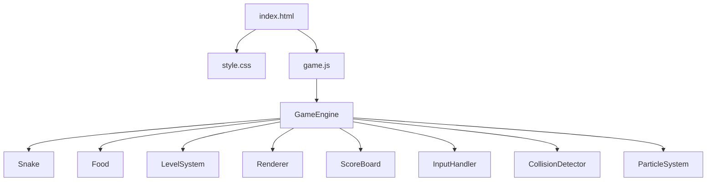
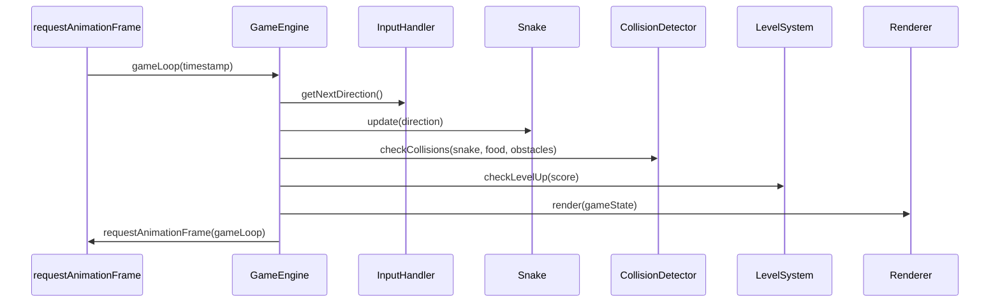

# 贪吃蛇游戏 — 技术设计文档

## 概述

本设计文档描述一款基于 HTML5 Canvas 的贪吃蛇游戏的技术架构与实现方案。游戏使用纯原生 HTML5、CSS3 和 JavaScript 实现，无任何外部依赖，所有文件存放在 `snake-game` 文件夹中，浏览器直接打开 `index.html` 即可运行。

核心特性包括：
- 高清 Canvas 渲染（devicePixelRatio 适配）
- 10 级关卡升级系统（速度递增 + 障碍物递增）
- 渐变蛇身、粒子动画、等级主题配色等视觉效果
- 键盘控制（方向键移动、空格暂停）、输入节流
- localStorage 持久化最高分

## 架构

### 整体架构

采用单页面应用架构，所有逻辑运行在浏览器端。核心采用 **游戏循环（Game Loop）** 模式，通过 `requestAnimationFrame` 驱动渲染，通过固定时间间隔驱动游戏逻辑更新。



### 游戏循环架构



### 文件结构

```
snake-game/
├── index.html    # 入口页面，包含 Canvas 和 UI 元素
├── style.css     # 样式表，布局与 UI 样式
└── game.js       # 全部游戏逻辑（引擎、蛇、食物、渲染等）
```

设计决策：将所有 JS 逻辑放在单个 `game.js` 文件中，使用 class 组织模块。这样做的原因是：
1. 无需构建工具或模块打包器
2. 浏览器直接打开即可运行
3. 代码量可控（预计 800-1200 行），单文件可维护

## 组件与接口

### GameEngine（游戏引擎）

游戏的核心控制器，管理游戏状态和游戏循环。

```javascript
class GameEngine {
  constructor(canvas)
  
  // 状态
  state         // 'menu' | 'playing' | 'paused' | 'gameover' | 'victory'
  snake         // Snake 实例
  food          // Food 实例
  obstacles     // Obstacle[] 障碍物数组
  score         // number 当前分数
  highScore     // number 历史最高分
  level         // number 当前等级 (1-10)
  
  // 方法
  init()                    // 初始化游戏，显示主菜单
  start()                   // 开始新游戏
  gameLoop(timestamp)       // 主游戏循环
  update()                  // 逻辑更新（蛇移动、碰撞检测、食物判定）
  togglePause()             // 切换暂停/恢复
  gameOver()                // 游戏结束处理
  victory()                 // 通关处理
  restart()                 // 重新开始
  saveHighScore()           // 保存最高分到 localStorage
  loadHighScore()           // 从 localStorage 读取最高分
}
```

### Snake（蛇）

```javascript
class Snake {
  constructor(startX, startY)
  
  // 状态
  body          // {x, y}[] 身体段坐标数组，body[0] 为头部
  direction     // 'up' | 'down' | 'left' | 'right'
  nextDirection // 下一帧生效的方向（输入缓冲）
  
  // 方法
  move()                    // 按当前方向移动一格
  grow()                    // 增加一个身体段（吃食物后调用）
  setDirection(dir)         // 设置方向（含防掉头校验）
  getHead()                 // 返回头部坐标 {x, y}
  containsPoint(x, y)      // 判断某坐标是否在蛇身上
}
```

### Food（食物）

```javascript
class Food {
  constructor()
  
  // 状态
  position      // {x, y} 食物坐标
  
  // 方法
  spawn(gridWidth, gridHeight, occupiedCells)  // 在空闲位置随机生成
}
```

### LevelSystem（关卡系统）

```javascript
class LevelSystem {
  constructor()
  
  // 状态
  level             // number 当前等级
  baseInterval      // number 基础移动间隔（毫秒）
  
  // 方法
  getThreshold(level)           // 返回升级所需累计分数: level × 50
  getScorePerFood(level)        // 返回当前等级每个食物的分值: level × 10
  getMoveInterval(level)        // 返回当前等级的移动间隔
  getObstacleCount(level)       // 返回当前等级的障碍物数量（<3级返回0）
  checkLevelUp(score)           // 检查是否升级，返回 {leveled: boolean, newLevel: number}
}
```

### Renderer（渲染器）

```javascript
class Renderer {
  constructor(canvas, ctx)
  
  // 方法
  setupHiDPI()                          // 高清适配
  clear()                               // 清空画布
  drawGrid(level)                       // 绘制网格背景（含等级主题配色）
  drawSnake(snake, direction)           // 绘制蛇（渐变色 + 眼睛）
  drawFood(food)                        // 绘制食物（光泽高光）
  drawObstacles(obstacles)              // 绘制障碍物
  drawScoreBoard(score, level, highScore) // 绘制分数面板
  drawMenu()                            // 绘制主菜单
  drawGameOver(score, level)            // 绘制游戏结束画面
  drawVictory(score)                    // 绘制通关画面
  drawPauseOverlay()                    // 绘制暂停遮罩
  drawLevelUpAnimation(level, progress) // 绘制升级过渡动画
}
```

### InputHandler（输入处理器）

```javascript
class InputHandler {
  constructor(gameEngine)
  
  // 状态
  pendingDirection  // 待处理的方向输入（节流：每个移动间隔只接受一次）
  locked            // boolean 输入锁定标志
  
  // 方法
  init()                        // 绑定键盘事件
  handleKeyDown(event)          // 处理按键事件
  getNextDirection()            // 获取并消费待处理方向
  lock()                        // 锁定输入（蛇移动后解锁）
  unlock()                      // 解锁输入
}
```

### CollisionDetector（碰撞检测器）

```javascript
class CollisionDetector {
  // 静态方法
  static checkSelfCollision(snake)              // 蛇头是否撞到自身
  static checkBoundaryCollision(head, gridW, gridH) // 蛇头是否超出边界
  static checkObstacleCollision(head, obstacles)    // 蛇头是否撞到障碍物
  static checkFoodCollision(head, food)             // 蛇头是否吃到食物
}
```

### ParticleSystem（粒子系统）

```javascript
class ParticleSystem {
  constructor()
  
  // 状态
  particles     // Particle[] 活跃粒子数组
  
  // 方法
  emit(x, y, color, count)     // 在指定位置发射粒子
  update(deltaTime)            // 更新所有粒子状态
  draw(ctx)                    // 绘制所有粒子
}
```


## 数据模型

### 核心数据结构

```javascript
// 坐标点（网格坐标，非像素坐标）
Point = { x: number, y: number }

// 蛇的状态
SnakeState = {
  body: Point[],                    // body[0] = 头部
  direction: 'up'|'down'|'left'|'right',
  nextDirection: 'up'|'down'|'left'|'right'
}

// 食物状态
FoodState = {
  position: Point
}

// 障碍物
Obstacle = {
  position: Point
}

// 粒子
Particle = {
  x: number,           // 像素坐标
  y: number,
  vx: number,          // 速度
  vy: number,
  life: number,        // 剩余生命（0~1）
  color: string,
  size: number
}

// 游戏状态
GameState = {
  state: 'menu'|'playing'|'paused'|'gameover'|'victory',
  score: number,
  highScore: number,
  level: number,        // 1-10
  snake: SnakeState,
  food: FoodState,
  obstacles: Obstacle[],
  particles: Particle[]
}
```

### 网格系统

画布采用网格坐标系统，所有游戏对象的位置以网格单元为单位：

| 参数 | 值 | 说明 |
|------|-----|------|
| CANVAS_SIZE | 600px | 画布逻辑尺寸 |
| CELL_SIZE | 20px | 每个网格单元的像素大小 |
| GRID_SIZE | 30 | 网格行列数 (600/20) |

蛇、食物、障碍物的坐标范围均为 `[0, GRID_SIZE-1]`。

### 等级配置

| 等级 | 升级阈值（累计分数） | 每食物分值 | 移动间隔(ms) | 障碍物数量 |
|------|----------------------|-----------|-------------|-----------|
| 1 | 50 | 10 | 200 | 0 |
| 2 | 100 | 20 | 180 | 0 |
| 3 | 150 | 30 | 162 | 3 |
| 4 | 200 | 40 | 146 | 4 |
| 5 | 250 | 50 | 131 | 5 |
| 6 | 300 | 60 | 118 | 6 |
| 7 | 350 | 70 | 106 | 7 |
| 8 | 400 | 80 | 96 | 8 |
| 9 | 450 | 90 | 86 | 9 |
| 10 | — | 100 | 77 | 10 |

移动间隔计算公式：`baseInterval × 0.9^(level-1)`，其中 `baseInterval = 200ms`。

### 等级主题配色

每个等级对应不同的背景配色方案：

```javascript
LEVEL_THEMES = [
  { bg: '#1a1a2e', grid: 'rgba(255,255,255,0.05)', snake: ['#00d2ff','#3a7bd5'] },  // L1 深蓝
  { bg: '#16213e', grid: 'rgba(255,255,255,0.06)', snake: ['#56ab2f','#a8e063'] },  // L2 森林
  { bg: '#1a1a2e', grid: 'rgba(255,255,255,0.05)', snake: ['#f7971e','#ffd200'] },  // L3 金色
  { bg: '#0f0c29', grid: 'rgba(255,255,255,0.04)', snake: ['#fc4a1a','#f7b733'] },  // L4 火焰
  { bg: '#200122', grid: 'rgba(255,255,255,0.05)', snake: ['#f953c6','#b91d73'] },  // L5 紫红
  { bg: '#0f2027', grid: 'rgba(255,255,255,0.06)', snake: ['#43cea2','#185a9d'] },  // L6 海洋
  { bg: '#1f1c2c', grid: 'rgba(255,255,255,0.05)', snake: ['#e44d26','#f16529'] },  // L7 烈焰
  { bg: '#141e30', grid: 'rgba(255,255,255,0.04)', snake: ['#a770ef','#cf8bf3'] },  // L8 梦幻
  { bg: '#0c0c0c', grid: 'rgba(255,255,255,0.03)', snake: ['#ffd700','#ff6347'] },  // L9 皇家
  { bg: '#000000', grid: 'rgba(255,255,255,0.08)', snake: ['#ff0000','#ff7700'] },  // L10 终极
]
```

### localStorage 数据

```javascript
// key: 'snakeGame_highScore'
// value: JSON string of number
localStorage.setItem('snakeGame_highScore', JSON.stringify(highScore))
```


## 正确性属性（Correctness Properties）

*属性（Property）是指在系统所有有效执行中都应成立的特征或行为——本质上是对系统应做什么的形式化陈述。属性是人类可读规范与机器可验证正确性保证之间的桥梁。*

### Property 1: HiDPI 缩放正确性

*对于任意* 正数 devicePixelRatio 值，Canvas 的内部像素尺寸（canvas.width, canvas.height）应等于逻辑尺寸乘以 devicePixelRatio，且 CSS 显示尺寸保持为逻辑尺寸不变。

**Validates: Requirements 1.2**

### Property 2: 方向键防掉头

*对于任意* 当前方向和任意尝试设置的新方向，如果新方向是当前方向的 180° 反向（上↔下、左↔右），则蛇的方向应保持不变；否则方向应更新为新方向。

**Validates: Requirements 2.1, 2.2**

### Property 3: 蛇每帧移动一格

*对于任意* 方向和任意有效的网格起始位置，蛇执行一次移动后，头部坐标应恰好在该方向上偏移一个网格单元（如方向为 'right' 则 x+1, y 不变）。

**Validates: Requirements 2.3**

### Property 4: 边界碰撞检测

*对于任意* 位于网格边缘的蛇头坐标和朝向边界外的移动方向，移动后碰撞检测应判定为越界。

**Validates: Requirements 2.4**

### Property 5: 输入节流

*对于任意* 在同一移动间隔内的多次方向键输入序列，仅第一次有效输入（非掉头）应被采纳，后续输入应被忽略。

**Validates: Requirements 2.5**

### Property 6: 食物生成不重叠

*对于任意* 蛇身体坐标集合和障碍物坐标集合，新生成的食物坐标不应与蛇身体或障碍物的任何坐标重合，且食物坐标应在网格范围内。

**Validates: Requirements 3.1, 3.4**

### Property 7: 吃食物蛇身增长

*对于任意* 长度为 N 的蛇，当蛇头与食物坐标重合并执行吃食逻辑后，蛇的长度应变为 N+1。

**Validates: Requirements 3.2**

### Property 8: 吃食物分数计算

*对于任意* 等级 L（1 ≤ L ≤ 10）和当前分数 S，吃掉一个食物后分数应变为 S + L × 10。

**Validates: Requirements 3.3**

### Property 9: 自身碰撞检测

*对于任意* 蛇身体配置，当蛇头坐标与身体中任意非头部段的坐标重合时，自身碰撞检测应返回 true；当蛇头不与任何身体段重合时，应返回 false。

**Validates: Requirements 4.1**

### Property 10: 障碍物碰撞检测

*对于任意* 蛇头坐标和障碍物集合，当蛇头坐标与任意障碍物坐标重合时，障碍物碰撞检测应返回 true；否则返回 false。

**Validates: Requirements 4.2**

### Property 11: 等级升级阈值

*对于任意* 等级 L（1 ≤ L ≤ 10）和累计分数 S，当 S ≥ L × 50 时应触发升级；当 S < L × 50 时不应触发升级。

**Validates: Requirements 5.1**

### Property 12: 移动速度公式

*对于任意* 等级 L（1 ≤ L ≤ 10），蛇的移动时间间隔应等于 `200 × 0.9^(L-1)` 毫秒（取整）。

**Validates: Requirements 5.2**

### Property 13: 障碍物数量与等级关系

*对于任意* 等级 L，当 L < 3 时障碍物数量应为 0；当 L ≥ 3 时障碍物数量应等于 L。

**Validates: Requirements 5.3**

### Property 14: 最高分持久化往返

*对于任意* 非负整数分数值，将其保存到 localStorage 后再读取，应得到相同的分数值。

**Validates: Requirements 6.3, 6.4**

### Property 15: 最高分实时更新

*对于任意* 当前最高分 H 和新分数 S，当 S > H 时最高分应更新为 S；当 S ≤ H 时最高分应保持为 H。

**Validates: Requirements 6.2**

### Property 16: 暂停切换往返

*对于任意* 处于 'playing' 状态的游戏，执行暂停操作后状态应变为 'paused'；再次执行暂停操作后状态应恢复为 'playing'。

**Validates: Requirements 7.1**

### Property 17: 暂停时蛇不移动

*对于任意* 处于暂停状态的游戏，调用更新逻辑后蛇的身体坐标应与更新前完全一致。

**Validates: Requirements 7.3**

### Property 18: 等级主题映射

*对于任意* 等级 L（1 ≤ L ≤ 10），获取的主题配色方案应与预定义主题数组中索引 L-1 的条目一致。

**Validates: Requirements 8.6**

## 错误处理

### 输入错误

| 场景 | 处理方式 |
|------|---------|
| 非方向键/空格键按下 | 忽略，不做任何处理 |
| 游戏未在 playing 状态时按方向键 | 忽略方向输入 |
| 游戏在 menu/gameover/victory 状态时按空格 | 忽略暂停操作 |

### 食物生成失败

| 场景 | 处理方式 |
|------|---------|
| 网格已满（蛇+障碍物占满所有格子） | 判定通关，显示胜利画面 |
| 食物生成尝试超过最大次数 | 遍历所有空闲格子，随机选取一个 |

### localStorage 错误

| 场景 | 处理方式 |
|------|---------|
| localStorage 不可用（隐私模式等） | 使用 try-catch 包裹，最高分仅保存在内存中 |
| 读取到无效数据（NaN、负数等） | 重置为 0 |

### Canvas 错误

| 场景 | 处理方式 |
|------|---------|
| 浏览器不支持 Canvas | 显示降级提示文字 |
| getContext('2d') 返回 null | 显示错误提示 |

## 测试策略

### 双重测试方法

本项目采用单元测试 + 属性测试的双重测试策略：

- **单元测试**：验证具体示例、边界情况和错误条件
- **属性测试**：验证跨所有输入的通用属性

两者互补，单元测试捕获具体 bug，属性测试验证通用正确性。

### 属性测试配置

- **测试库**：[fast-check](https://github.com/dubzzz/fast-check)（JavaScript 属性测试库）
- **测试框架**：使用 Node.js 环境下的测试运行器（如 vitest 或 jest）
- **每个属性测试最少运行 100 次迭代**
- **每个测试必须用注释标注对应的设计属性**
- **标注格式**：`Feature: snake-game, Property {number}: {property_text}`
- **每个正确性属性由一个属性测试实现**

### 单元测试覆盖

单元测试聚焦于：
- 具体示例：游戏初始化后 Canvas 尺寸为 600×600（需求 1.1）
- 具体示例：主菜单包含"开始游戏"按钮（需求 1.3）
- 具体示例：重新开始按钮在游戏结束画面可用（需求 4.4）
- 具体示例：关卡系统支持 10 个等级（需求 5.6）
- 具体示例：浏览器打开 index.html 可正常运行（需求 9.3）
- 边界情况：网格已满时判定通关（需求 3.5）

### 属性测试覆盖

每个正确性属性（Property 1-18）各对应一个属性测试，使用 fast-check 生成随机输入：

| 属性 | 生成器策略 |
|------|-----------|
| Property 1 | 生成随机正数 dpr (0.5~4.0) |
| Property 2 | 生成随机 (当前方向, 新方向) 对 |
| Property 3 | 生成随机方向和有效网格坐标 |
| Property 4 | 生成边缘坐标和朝外方向 |
| Property 5 | 生成随机方向输入序列 (2~10个) |
| Property 6 | 生成随机蛇身体和障碍物集合 |
| Property 7 | 生成随机长度的蛇 |
| Property 8 | 生成随机等级 (1-10) 和分数 |
| Property 9 | 生成随机蛇身体（含/不含自交叉） |
| Property 10 | 生成随机蛇头坐标和障碍物集合 |
| Property 11 | 生成随机等级和分数 |
| Property 12 | 生成随机等级 (1-10) |
| Property 13 | 生成随机等级 (1-10) |
| Property 14 | 生成随机非负整数 |
| Property 15 | 生成随机 (当前最高分, 新分数) 对 |
| Property 16 | 无需生成器（确定性状态转换） |
| Property 17 | 生成随机蛇身体配置 |
| Property 18 | 生成随机等级 (1-10) |

### 测试文件结构

```
snake-game/
├── __tests__/
│   ├── snake.test.js          # Snake 类单元测试 + 属性测试
│   ├── collision.test.js      # CollisionDetector 单元测试 + 属性测试
│   ├── level.test.js          # LevelSystem 单元测试 + 属性测试
│   ├── food.test.js           # Food 生成单元测试 + 属性测试
│   ├── input.test.js          # InputHandler 单元测试 + 属性测试
│   ├── score.test.js          # 分数与持久化测试
│   └── gameEngine.test.js     # GameEngine 状态管理测试
└── ...
```
